# BeautyBook CRM — Portfolio Case

## Live Demo

https://beautybook-crm.vercel.app/

- Public website can be viewed freely.
- CRM is protected by staff login.
- No real client data is used.

## Problem

A beauty salon needs a simple system to:

- keep a client base;
- manage masters;
- manage services;
- create appointments;
- avoid time conflicts;
- see revenue and basic workload signals.

Many booking tools are either too generic or too heavy for a small salon. The MVP focuses on daily administrator work and safe client data handling.

## Solution

BeautyBook CRM provides:

- a public salon website;
- booking without a client account as the product direction;
- staff-only CRM;
- owner dashboard;
- clients, services, masters and appointments;
- salon profile and working hours settings.

The CRM gives staff a focused operational surface while keeping the public website simple for clients.

## Key UX Decisions

- Clients do not create accounts.
- CRM access is staff-only.
- Staff roles are owner, admin and master.
- Appointment price is copied from the selected service at booking time.
- Working hours are validated before appointments are created or edited.
- Scheduled appointment conflicts are checked by master, date and time.
- Mobile layout is treated as a core MVP requirement.

## Architecture

- Next.js App Router handles public and staff routes.
- Supabase Auth authenticates staff users.
- Supabase Postgres stores CRM data.
- Supabase RLS protects salon-owned tables.
- Server Actions handle mutations.
- Zod validates form inputs.
- `getAdminContext()` reads the current user, profile, salon and role.
- CRM data access is scoped by `salon_id`.

## Security Model

- No service role key is used in the app.
- RLS is enabled for public MVP tables.
- Server-side role checks protect CRM actions.
- `salon_id` comes from server-side admin context.
- UI and actions use safe error messages.
- Clients do not use Supabase Auth.
- Client notes, appointment comments and sensitive contact data are treated as private CRM data.

## MVP Result

Implemented:

- public website foundation;
- staff-only login;
- disabled public registration;
- protected `/admin`;
- legacy `/dashboard` redirect;
- owner/admin/master permission matrix;
- dashboard with real Supabase data;
- clients list, create, search and edit;
- client profile with visit history and stats;
- services management;
- masters management;
- appointments create/edit/status flow;
- appointment conflict detection;
- salon working hours validation;
- salon settings;
- mobile UX polish;
- portfolio screenshots;
- production deployment;
- security and privacy documentation.

## Screenshots

### Public Website

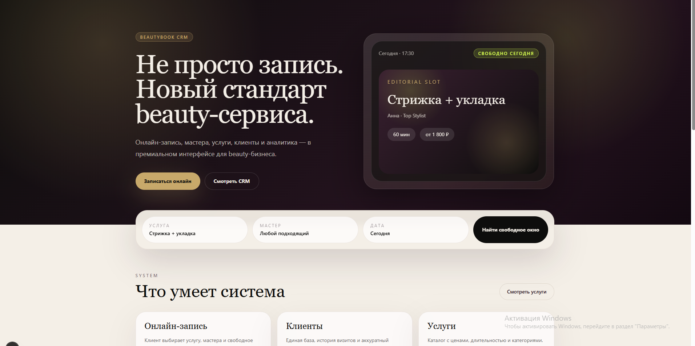

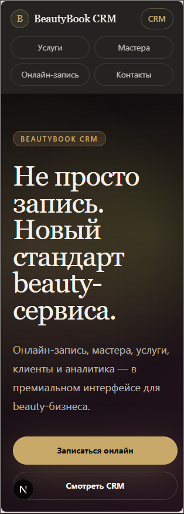

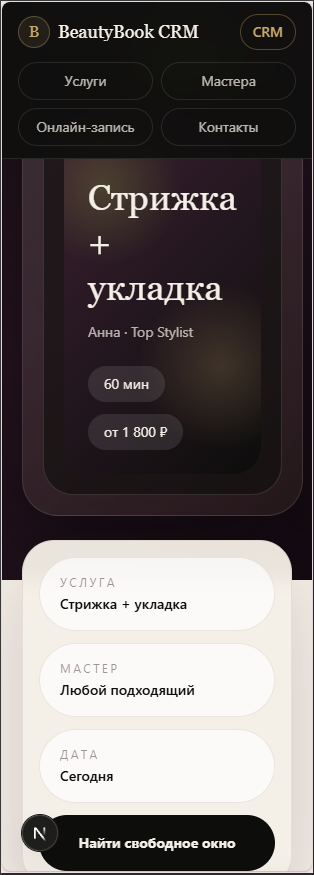

### Staff Authentication

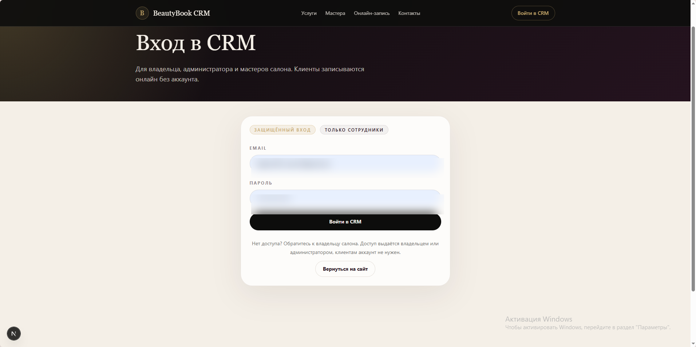

### CRM Dashboard and Roles

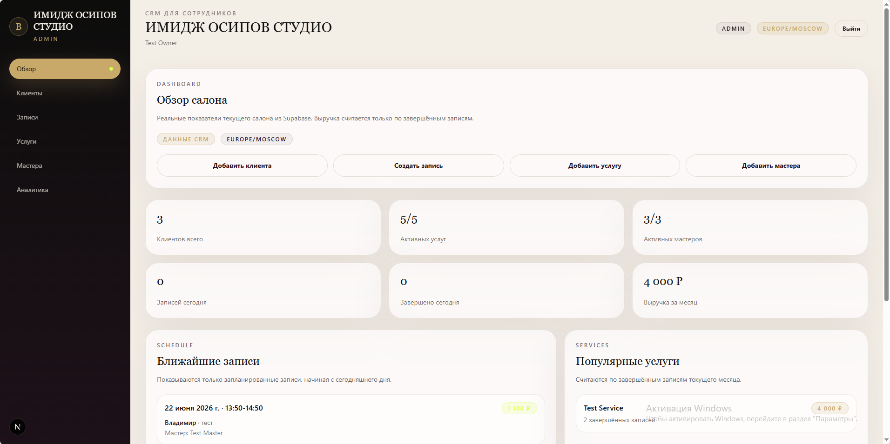

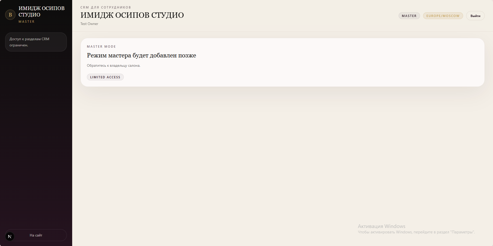

### CRM Operations

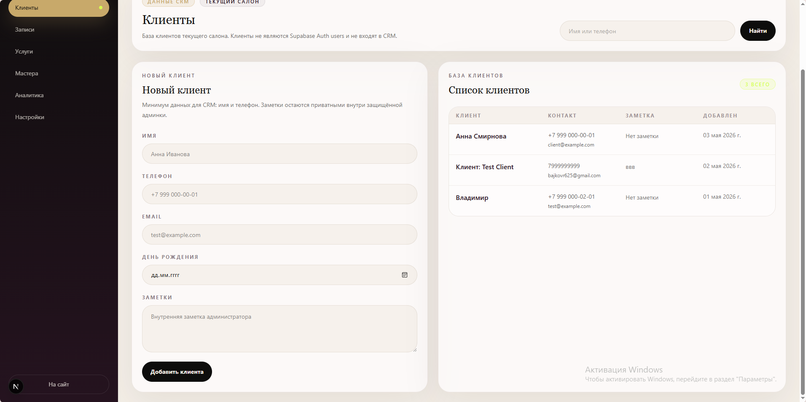

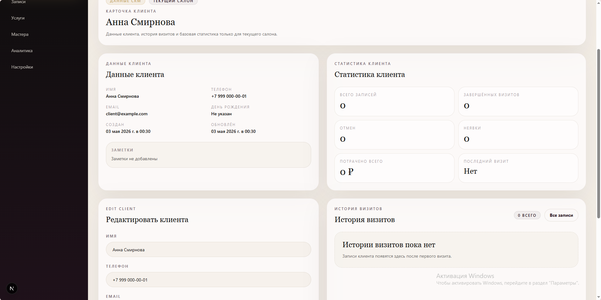

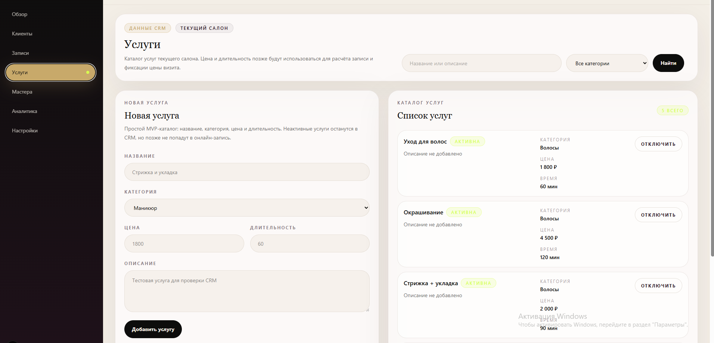

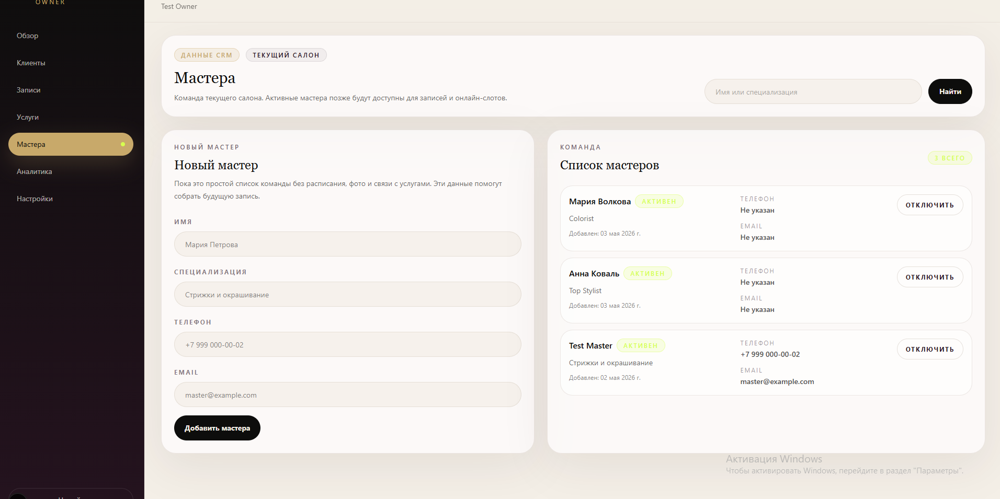

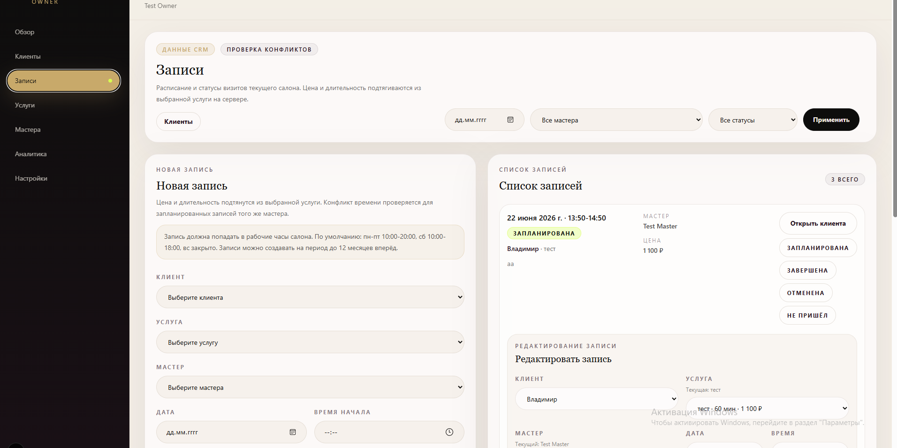

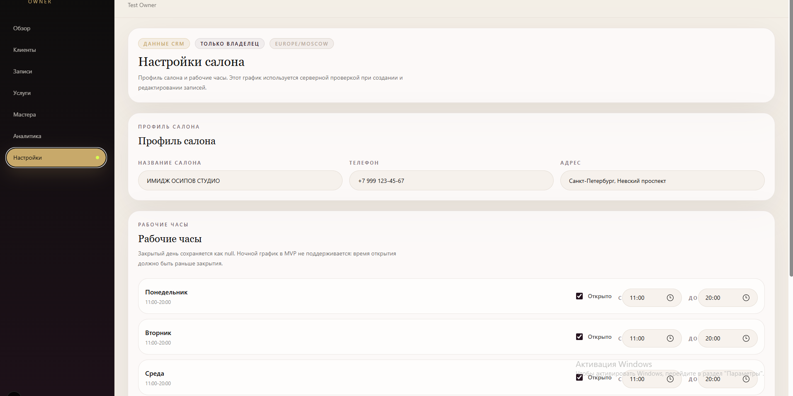

### Mobile CRM

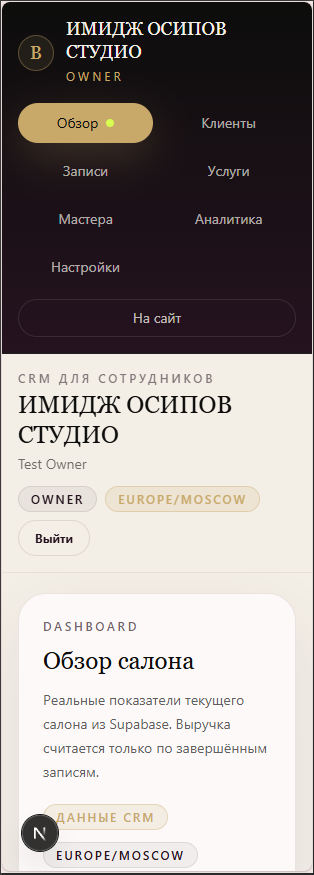

## What I Would Build Next

- Public booking action that creates real scheduled appointments.
- Booking success page and token-based booking management.
- Telegram/email reminders.
- Database-level conflict guard.
- Staff invites and onboarding.
- Master schedule and availability.
- Calendar view.
- Payments or prepayments.
- Analytics charts.
- Automated tests for appointment rules and permissions.
- Production hardening.
